  

## 📊 GitHub Stats & Trophies

  
  

  

  

## 🛠️ Languages & Tools

> ## Programming Languages

    

> ## Frontend & Mobile

   

> ## Backend

  

> ## Database

 

> ## DevOps & Cloud

  

> ## Tools

  

  

 

## 🔗 Connect with Me

  

  

